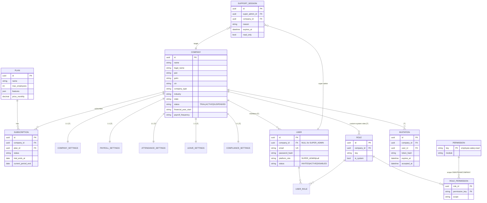
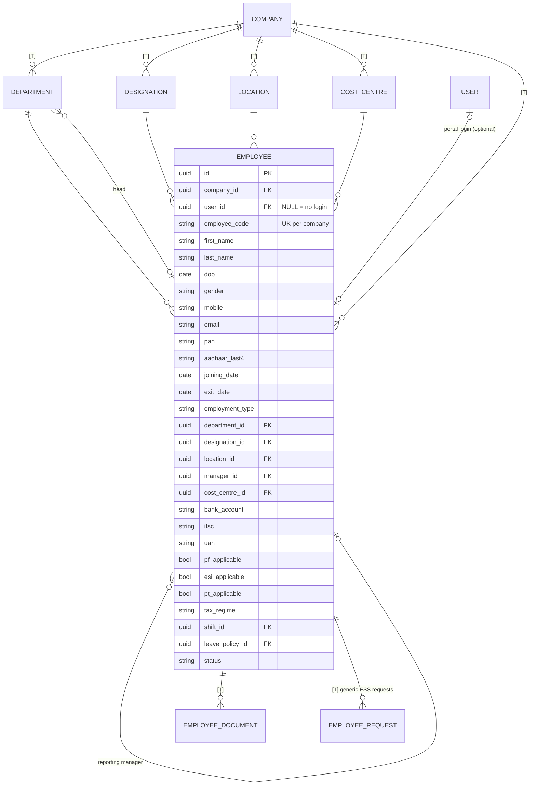
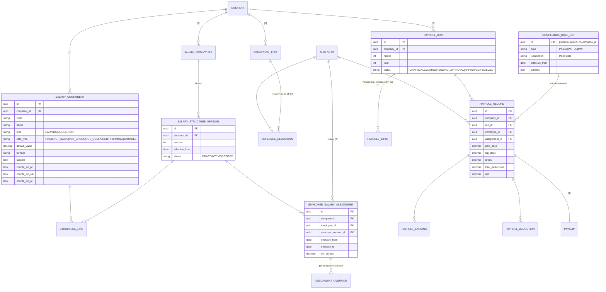
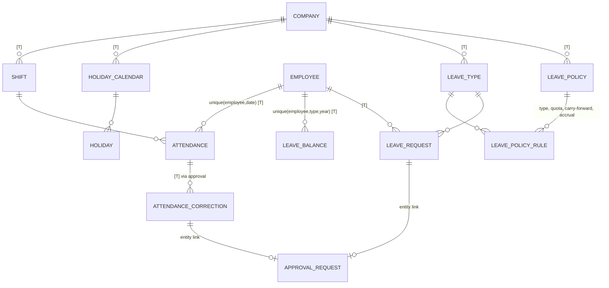
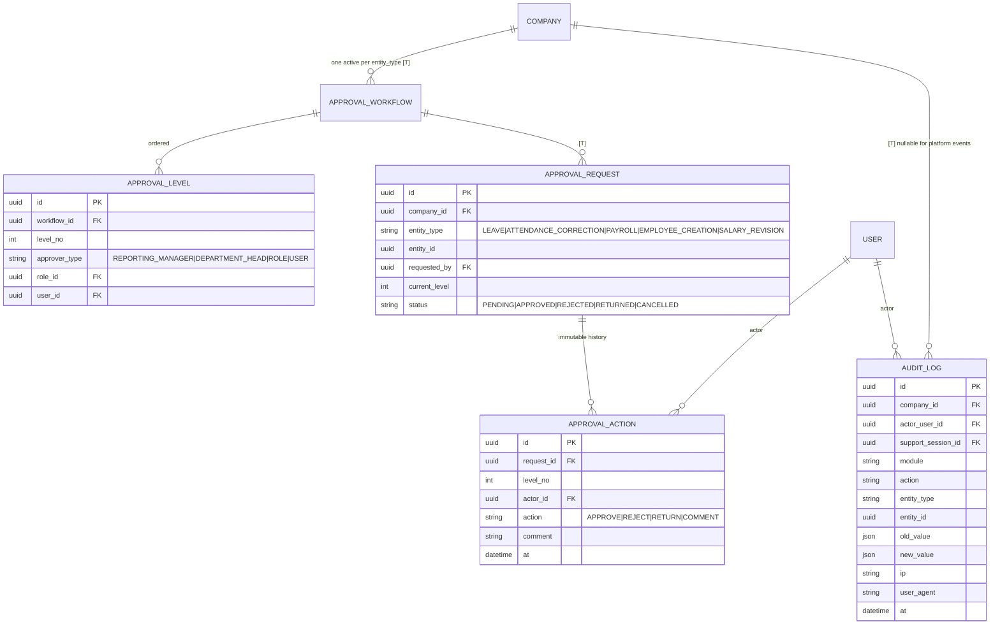

# Multi-tenant payroll SaaS — architecture proposal

Status: **phase 1 (foundation) implemented**; phases 2-7 pending. Decisions taken: Postgres now, copyable invite links (no email provider yet), existing data migrated as tenant #1.

Phase 1 deviates from the proposal in these ways: it kept the existing simple salary/leave/attendance tables (now tenant-scoped) rather than the full component/policy model, which arrive in phases 5-6; `Employee.managerId` was added early to make TEAM-scoped permissions real; tenant guards use `withTenant()` transactions rather than a per-query wrapper so the audit row commits atomically with the change.

Decision changes after phase 1: **statutory rates are per company** (each company gets prefilled defaults and edits them in its own Settings; there is no platform-level rates screen), and the **income-tax regime is a property of the employee**, not of a salary structure.

Diagrams are Mermaid. In VS Code install "Markdown Preview Mermaid Support", or paste a block into https://mermaid.live.

---

## 1. Where the project is today

Stack: Next.js 16 (App Router, Server Actions), Prisma 6, SQLite (dev), Auth.js v5 credentials, Tailwind 4, Vitest.

| Requirement | Today | Gap |
| --- | --- | --- |
| Multi-tenancy | One `Company` row; no `companyId` anywhere; `PayrollRun` is unique on `(month, year)` globally | **Everything** |
| Super Admin portal | None | New |
| Roles | `User.role` = ADMIN / EMPLOYEE, checked ad hoc in each action | Need RBAC (roles, permissions, scopes) |
| Employee ↔ login | `Employee.userId` is **required** | Employees must exist without a login |
| Salary structure | Four fixed columns per employee (basic/HRA/special/other) | Configurable components, formulas, templates, versions |
| Deductions | PF/ESI/PT/TDS only, hard-coded | Configurable deductions |
| Statutory | `StatutoryConfig` table is global and versioned (good base) | Split: platform-owned rules vs. company applicability |
| Approvals | Leave approve/reject hard-coded in a page | Generic workflow engine |
| Audit log | None | New |
| Attendance / leave | Per-day status; leave types with quota | Shifts, corrections, policies, holidays |
| Subscriptions / plans | None | New |
| Invitations | Admin types a temporary password | Invite-by-token flow |
| **UI kit, bulk CSV import, payroll math + tests** | Built | **Kept.** Re-pointed at the tenant context |

Security finding that motivates the design: several actions take a record id as an argument (e.g. `addSalaryStructure(employeeId, …)`, `decideLeaveRequest(requestId, …)`) and never check who owns that record. Harmless with one company; a cross-tenant hole with many. The design below makes that class of bug impossible rather than something each action must remember.

---

## 2. Architecture decisions

### 2.1 Tenancy: defence in depth

1. **Tenant column everywhere.** Every tenant-owned table has `companyId NOT NULL` with an index; child tables carry it too (denormalised) so filters never need a join.
2. **Tenant-scoped data access.** Application code never uses the raw Prisma client. It gets `db = tenantDb(ctx)`, a Prisma client extension that injects `companyId` into every `where` (read, update, delete, upsert) and into every `create`. Forgetting a filter becomes impossible; a `findUnique({ id })` for another tenant's row returns `null`.
3. **Database enforcement (Postgres Row-Level Security).** Each tenant query runs after `set_config('app.tenant_id', …)`; RLS policies `USING (company_id = current_setting('app.tenant_id'))` are the backstop if layer 2 has a bug. The app connects as a non-owner role so RLS cannot be bypassed.
4. **Isolation tests.** A test suite creates two tenants and tries every service function across the boundary. CI fails if any leaks.

Platform tables (plans, compliance rule sets, permission catalogue, super-admin users) have no `companyId` and are only reachable from the platform portal.

### 2.2 Request context and guards

```
request → session (userId, companyId | null, actingAs?) 
        → loadContext(): user, company, roles, permissions (from DB each request, so revocation is immediate)
        → guard(permission, scope?)  → service function(ctx, input)
        → tenantDb(ctx) + audit(ctx, …) in the same transaction
```

- Session cookie holds only identity, never permissions.
- Every Server Action / route handler is `withCtx({ permission: "leave.approve" }, async (ctx, input) => …)`. No screen checks a role name.
- Frontend hides what you cannot use, but the backend is the authority.

### 2.3 RBAC

- **Permission catalogue** lives in code (`employee.read`, `employee.salary.read`, `payroll.run`, `leave.approve`…) and is synced to a `permissions` table. Not editable by tenants.
- **Roles** are per company. Six system roles are seeded when a company is created (COMPANY_ADMIN, HR_MANAGER, PAYROLL_MANAGER, FINANCE_MANAGER, MANAGER, EMPLOYEE); admins may clone/customise. `SUPER_ADMIN` is a platform role.
- **Scope** on each grant: `OWN` / `TEAM` / `COMPANY`. This is how a MANAGER can approve *team* leave and attendance corrections but never see salary — `employee.salary.read` simply isn't granted.
- Guard for the last COMPANY_ADMIN: a company can never be left without one.

### 2.4 Approval engine (generic)

A workflow is `entityType` (LEAVE, ATTENDANCE_CORRECTION, PAYROLL, EMPLOYEE_CREATION, SALARY_REVISION, EXPENSE…) + ordered levels. Each level names an approver *resolver*: reporting manager, department head, a role, or a specific user. Domain modules never contain approval logic; they call `approvals.submit(entityType, entityId)` and register a callback for "fully approved / rejected / returned". Every action (approve, reject, return-for-correction, comment) is an immutable `approval_actions` row and an audit event.

### 2.5 Salary model: configurable, versioned, snapshotted

```
SalaryComponent (company master: Basic, HRA, Bonus…  type, calcType, formula, flags)
      ↓ used by
SalaryStructure (template "Standard", "Manager")  →  SalaryStructureVersion (effectiveFrom, status)  →  lines (component, value/percent/formula, order)
      ↓ assigned to
EmployeeSalaryAssignment (employee, structureVersion, effectiveFrom, CTC, per-component overrides)   ← never updated in place; a revision adds a row
      ↓ payroll run reads the assignment effective for the period
PayrollRecord + PayrollEarning + PayrollDeduction   ← frozen snapshot per run
```

- `calcType`: FIXED, PERCENT_OF_BASIC, PERCENT_OF_GROSS, PERCENT_OF_COMPONENT, FORMULA, VARIABLE (amount supplied monthly as a payroll input).
- Flags per component: taxable, counts toward PF wage, counts toward ESI wage, counts toward PT gross.
- **Formulas** use a small, safe expression evaluator (numbers, component codes, `+ - * / ( )`, `min`, `max`, `round`) — no `eval`. Dependency order is resolved and cycles are rejected at save time.
- Payroll records are snapshots, so later structure/rate changes never rewrite history (same principle the current `Payslip.breakdown` already follows).

### 2.6 Compliance layer

- **Platform-owned `ComplianceRuleSet`**: `type` (PF, ESI, PT, TDS, LWF), `jurisdiction` (IN or a state), `effectiveFrom`, `params` (JSON: rates, ceilings, slabs). Maintained centrally by Super Admin; the existing `StatutoryConfig` data migrates into it.
- **Company `ComplianceSettings`**: which schemes apply, registration numbers, options (e.g. PF on actual vs. ceiling wage), state for PT/LWF.
- **Employee statutory flags**: PF/ESI/PT applicability, UAN, TDS regime.
- **Engine**: pure functions `computePF(ruleSet, wages, options)`, etc. Inputs → outputs, no database access, fully unit-tested (today's `payroll-calculations.ts` and its tests are the starting point).
- I will **not** bake rates into code. Note on accuracy: rule *values* need CA/legal verification; the platform makes them updatable in one place, it does not certify them.

### 2.7 Audit and support access

- `audit_logs` is append-only (a Postgres trigger rejects UPDATE/DELETE). Written by `audit(ctx, …)` inside the same transaction as the change, so a change without an audit row cannot commit. Stores actor, company, module, action, entity, before/after JSON, IP, user agent, and `supportSessionId` when relevant.
- **Support access**: Super Admin starts a `support_session` for a company (mandatory reason, optional ticket, auto-expiry, **read-only by default**). The session is visible to the company admin, a banner shows on every page, and every action is audited with the support actor. Super Admin has no route to edit payroll data directly.

### 2.8 Code layout (modular monolith)

```
src/server/                  ← no React, no HTTP; unit-testable
  tenancy/  auth/  rbac/  audit/  approvals/  compliance/  payroll/  attendance/  leave/  employees/  …
src/app/
  (platform)/platform/…      ← Super Admin portal
  (company)/…                ← Company admin/HR/payroll/manager
  (ess)/me/…                 ← Employee self-service
  login, accept-invite
src/components/              ← existing UI kit (kept)
```

Future modules (loans, F&F, reimbursements, documents, biometric, accounting) are new folders under `src/server/` plus new tables carrying `companyId`; they plug into approvals, audit and RBAC without touching the core.

---

## 3. Entity-relationship design

Legend: `PK`, `FK`. Every table marked **[T]** is tenant-owned and carries `company_id`. Only key columns are shown.

### 3.1 Platform, tenancy, identity, RBAC



### 3.2 Organisation and employees



### 3.3 Salary, deductions, compliance, payroll


`PAYROLL_RUN` is unique on `(company_id, month, year)`.

### 3.4 Attendance and leave



### 3.5 Approvals and audit



### 3.6 Separation of concerns

| Concern | Tables |
| --- | --- |
| Master data | company, department, designation, location, cost_centre, employee, holiday |
| Configuration | *_settings, salary_component/structure/version/line, deduction_type, leave_type/policy, shift, approval_workflow/level, role/role_permission |
| Transactions | attendance, attendance_correction, leave_request/balance, payroll_input/run/record/earning/deduction, payslip, employee_deduction |
| Workflow | approval_request, approval_action |
| Compliance | compliance_rule_set (platform), compliance_settings, employee statutory flags |
| Audit | audit_logs, support_session |
| Platform | plan, subscription, permission catalogue, super-admin users |

---

## 4. Migration of what already exists

- Existing `Company` row → **tenant #1**. Every existing row is back-filled with its `company_id`.
- Existing ADMIN user → COMPANY_ADMIN of tenant #1; a SUPER_ADMIN user is seeded separately.
- Current 4-column salary structures → a "Standard" structure with Basic / HRA / Special / Other components, plus one assignment per employee (history preserved).
- `StatutoryConfig` rows → `compliance_rule_set` (PF, ESI, PT, TDS).
- Bulk CSV import keeps its files and templates; importers receive `ctx.companyId` and write through `tenantDb`. The salary CSV keeps its columns and creates assignments against the "Standard" structure.
- UI kit, payroll math and its tests are reused.

## 5. Delivery phases

Each phase is shippable and ends with tests (isolation tests from phase 1 onward).

1. **Foundation** — Postgres, tenant tables, users/roles/permissions, `tenantDb`, RLS, request context + guards, audit service, data migration of existing data. Existing screens keep working, now tenant-scoped.
2. **Super Admin** — dashboard, clients, plans/subscriptions, create client (initialises all settings + roles + company admin invite), suspend/activate, system users, support access, platform audit log.
3. **Company shell + setup wizard** — new navigation, invitation acceptance, 8-step wizard with progress, settings screens, Users & Roles.
4. **Master data + Employees + Approval engine** — departments/designations/locations, full employee master, employee portal login via invite, workflows + My Approvals + history.
5. **Salary + Deductions + Compliance** — components, structures/versions, assignments, deduction types, rule sets and engine.
6. **Attendance → Leave** — shifts, corrections, holidays, policies, balances, all wired through the approval engine.
7. **Payroll** — inputs, run/approve/finalize, register, payslips, bank payment file, reports.

## 6. Decisions needed before phase 1

1. **Database**: move to Postgres now (needed for RLS; `docker-compose.yml` already defines it) vs. stay on SQLite until later (no DB-level isolation).
2. **Invitations**: no email service is configured. Options: show a copyable invite link in the UI (works immediately), or integrate an email provider (needs your choice/credentials).
3. **Existing data**: keep the current dev data as tenant #1, or start clean with a fresh seed.
4. **One person, one company?** Recommended: a login belongs to exactly one company. Consultants who serve several companies would need separate logins.
5. **IDs**: switch to UUIDs/cuid (current default is cuid; fine to keep).

## 7. Phase 6 as built: shifts, attendance, leave, configurable salary

Migration `20260921150000_shifts_attendance_salary_leave_approvals` (data-preserving: old fixed-column
salary structures became "Standard" structure assignments; old leave quotas became ledger opening entries).

- **Pure engines, no DB**: `src/lib/attendance/{calendar,engine,lop}.ts`, `src/lib/leave/planner.ts`,
  `src/lib/salary/compute.ts`, `src/lib/time.ts` (minutes after midnight, IST offset). Services in
  `src/server/{attendance,leave,salary,approvals,rules}` load company rules and call them.
- **Tables** (all tenant tables with composite `(companyId, id)` FKs and RLS): `SalaryComponent`,
  `SalaryTemplate(+Line)`, `EmployeeSalary` (lines JSON snapshot), `Shift`, `AttendanceRule`, `Holiday`,
  `LeaveType`, `LeavePolicy(+Rule)`, `LeaveLedger`, `LeaveRequest`, `ApprovalWorkflow/Level/Request/Action`,
  `CompanySetting`.
- **Payroll**: `calculatePayrollFromLines` takes the company's own earning lines; `calculateMonthlyPayroll`
  still works for the old four-column shape. Loss of pay comes from `computeLop`; overtime is an earning
  only if `otPayable`.
- **Approvals**: a workflow's levels are snapshotted on each request; handlers (`leaveApprovalHandler`)
  apply the outcome (ledger entry + attendance marks) in the same transaction as the decision.

Known gaps (deliberately not built yet): return-for-correction on approvals, an attendance-correction
request workflow, formula-based salary components, leave encashment payout, comp-off automation,
per-industry presets, and a foreign key from `LeaveType` to `Company` (orphans are possible). The old
`scripts/migrate-legacy.ts` is superseded and no longer runnable.


## 8. Phase 7 as built: employee offboarding

Migration `20260922090000_employee_offboarding` (adds `SUSPENDED`/`RESIGNED` to `EmploymentStatus`, the
`EmployeeSuspension` and `EmployeeSeparation` tables + RLS, and backfills the `employee.offboard` /
`resignation.request` permissions, role grants and a per-company RESIGNATION approval workflow —
mirroring LEAVE's — for every existing company).

- **Model**: `src/server/employees/lifecycle.ts` holds all of it — `suspendEmployee`/`endSuspension`,
  `submitResignation`/`updateResignationNotice`/`withdrawResignation`/`resignationApprovalHandler`
  (plugs into the existing generic approval engine, same as leave), and `terminateEmployee` (no approval
  step — an employer decision). `ensureLifecycleStatuses` is the lazy sweep that keeps `Employee.status`
  caught up with dates that have since arrived; called wherever the roster or a status badge is read.
- **Payroll**: `computeLop` gained `excludedDates` (suspended working days — folds into loss of pay,
  `daysInPeriod` unchanged) and `employedThrough` (last paid day — every day after it is unpaid,
  including weekly offs, but `daysInPeriod` still doesn't shrink: the fraction has to stay
  `paidDays / daysInPeriod` against the full month or a mid-month exit would be paid in full). Getting
  this proration right took a few wrong turns during development — see the reasoning in the field
  comments on `LopInput` before changing it again.
- **UI**: everything lives on the employee's own profile page (`employees/[id]/page.tsx`, "Offboarding"
  card) — including the employee's own self-service resignation form. That page's permission gate had to
  change from "TEAM scope only" to "OWN scope on your own record, else TEAM", since a plain employee
  never holds TEAM scope and would otherwise never be able to reach it.
- **Roster**: `ROSTER_STATUSES` / `SEPARATED_STATUSES` (from `lifecycle.ts`) replace the old
  `status: { not: "TERMINATED" } }` checks scattered around employee pickers. The Directory defaults to
  roster statuses (suspended people still show; resigned/terminated don't); **Employees → Separated** is
  the dedicated report for the latter, gated on `employee.read` at COMPANY scope.

Not built: reinstating a termination (a new hire is the only way back), blocking login after separation
(the `User` account itself is untouched), and joining-date proration (a pre-existing gap, not part of
this phase — see phase 6's note).
